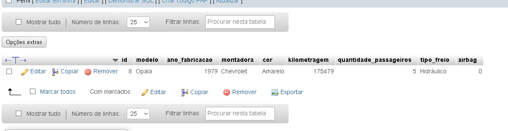
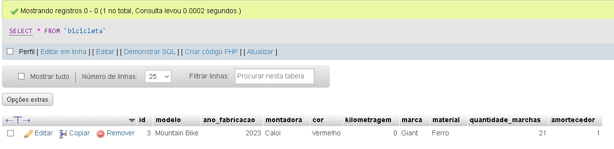
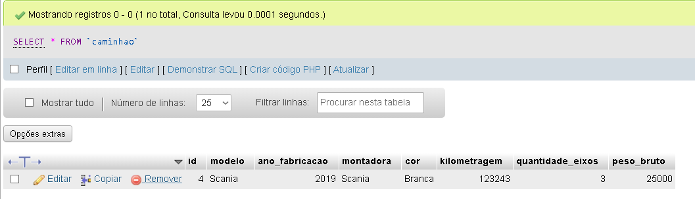
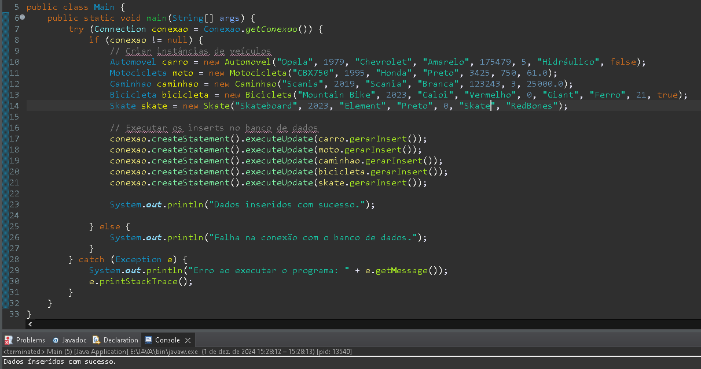
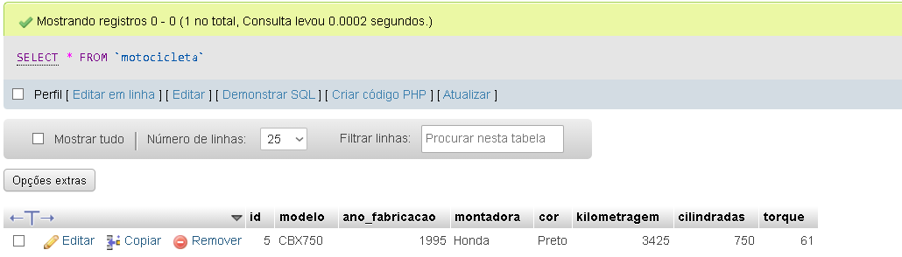
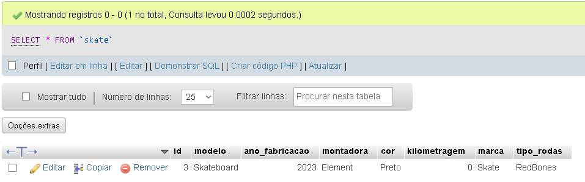

# HERANCA_3

Sistema feitos para gerar dados de veiculos autonomos e domesticos 😃. Uns dos melhores a ser feito, pois eu gosto de carros 

## 🚀 Começando

Um sistema processa dados de veículos de vários tipos. Nesse sistema, todos os automotores possuem modelo, ano de fabricação, montadora, cor, e kilometragem (odômetro). Um automóvel doméstico possui também quantidade máxima de passageiros, tipo de freio e airbag. As motocicletas possuem cilindradas e torque. Os caminhões possuem quantidade de eixos e peso bruto. As bicicletas possuem, modelo, marca, cor, material, quantidade de marchas e amortecedor. Os skates possuem modelo, marca, cor e tipo das rodas. O modelo e ano de fabricação são obrigatórios para todos os veículos.

Todos os atributos devem ser encapsulados e validados quando necessário.

Todas as classes devem ter seus construtores e um método que gera o comando insert desses dados. Para isso, considere o nome classe como o nome da tabela e cada atributo da classe como um campo desta tabela. Pesquisar sobre override pode ser útil.

Crie vários objetos para testar as classes e seus métodos.

## 🛠️ Construído com

* IDE Eclipse

## 📌 Versão

* **Versão 1.0**
  
## ✒️ Autores

* **Ryan Rezani** - *Trabalho Inicial* 